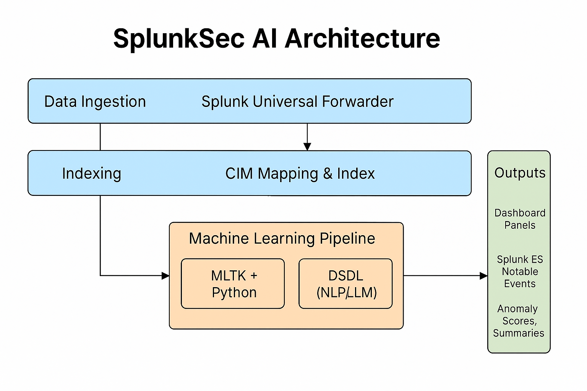

# SplunkSec AI: An AI-Driven Cybersecurity Monitoring Platform

**Track:** Splunk Build-a-thon 2025 – Track 4 (AI/ML)

## 🔍 Problem Statement

SOC teams are overwhelmed by security log noise, false positives, and delayed response. Traditional rule-based SIEMs miss stealthy, advanced threats. SplunkSec AI addresses this using ML-powered anomaly detection, event clustering, and NLP-based incident summaries — fully integrated with Splunk.

## 🚀 Solution Overview

- **Unsupervised Anomaly Detection**: Isolation Forests, Autoencoders
- **Event Clustering**: DBSCAN and correlation to detect attack campaigns
- **User Behavior Profiling (UEBA)**: Time-series behavior analysis
- **NLP Summaries**: Splunk DSDL app + LLM-generated incident descriptions
- **Native Integration**: SPL-based scoring, dashboarding, and alerting in Splunk

## 🧱 Architecture

1. Logs ingested via **Splunk Universal Forwarders**
2. Data mapped to **CIM**
3. Models run in **MLTK + Python**
4. Summarization via **DSDL**
5. Output shown in dashboards, alerts, and Splunk ES



## 📂 Repository Structure

```
SplunkSecAI/
├── src/                  # ML model scripts (Python or SPL)
├── dashboards/           # Dashboard JSON/XML exports
├── sample_logs/          # Synthetic or test log data
├── docs/                 
│   ├── architecture.png
│   ├── instructions.pdf
│   └── presentation.pdf
├── README.md             # With usage and explanation
├── requirements.txt      # Python dependencies (if any)
└── LICENSE
```

## 📽️ Demo

Video Walkthrough: [Link to YouTube Demo]

## 🔧 Tech Stack

- Splunk Enterprise / Dev Edition
- MLTK, DSDL App, Python, ONNX
- Isolation Forest, Autoencoder, DBSCAN
- SPL queries and dashboards

## 📜 License

MIT License (see LICENSE file).